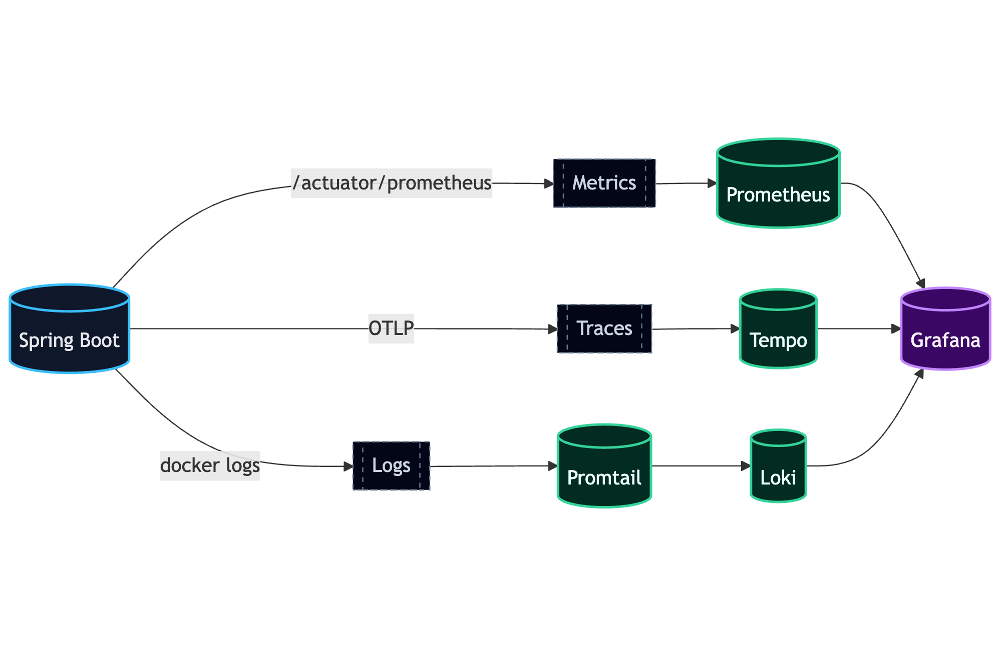
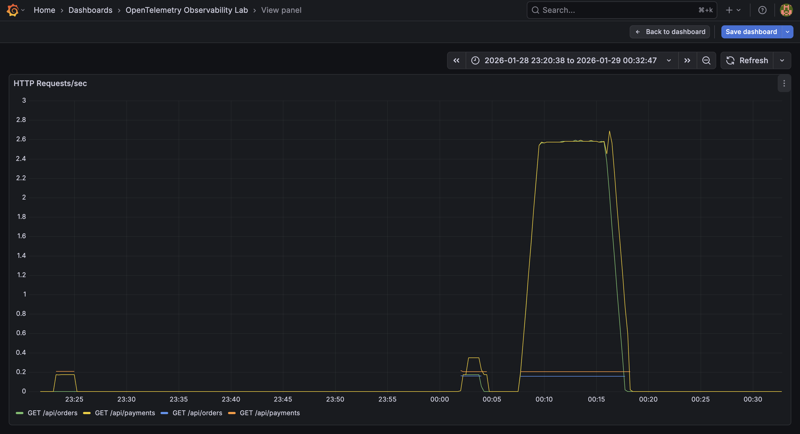
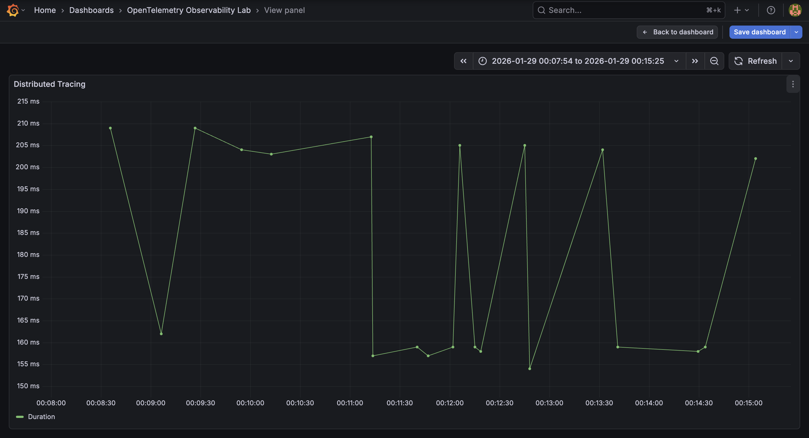
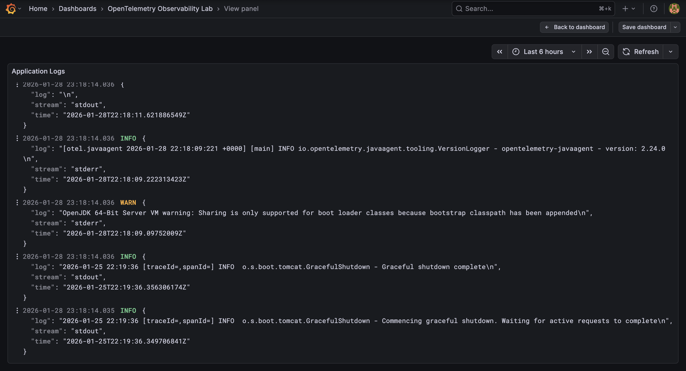

# Spring Boot OpenTelemetry Observability Lab

## Case Study: Building Production-Grade Observability from Scratch

[](http://localhost:9090)
[](http://localhost:3200)
[](http://localhost:3100)
[](http://localhost:3000)

A production-ready Spring Boot application demonstrating comprehensive observability using OpenTelemetry Java Agent, Prometheus, Tempo, Loki, and Grafana. This case study shows how to implement the **three pillars of observability** (metrics, traces, and logs) with **SLO monitoring** in a modern microservices environment.

## Architecture

### System Architecture Diagram




### Key Components

- **Distributed Tracing**: OpenTelemetry Java Agent → Tempo (automatic, zero-code instrumentation)
- **Metrics**: Micrometer + Prometheus (custom business metrics + auto-instrumentation)
- **Centralized Logging**: Container logs → Promtail → Loki
- **Unified Visualization**: Grafana (single pane of glass for all observability data)
- **SLO Monitoring**: PromQL-based SLOs tracking success rate and P95 latency

### Key Feature: Zero-Code Observability

This project demonstrates **production-ready observability without modifying application code**. The OpenTelemetry Java Agent automatically instruments all HTTP requests, service calls, and exceptions—no manual span creation needed.

## What You'll Learn

This case study teaches you how to implement comprehensive observability in a Spring Boot application:

### 1. **Spring Boot + OpenTelemetry Java Agent**

- Automatic instrumentation without code changes using the OpenTelemetry Java Agent
- Attaching the agent via Docker `-javaagent` flag
- Configuring telemetry export through environment variables (`OTEL_*`)
- Understanding what gets traced automatically (HTTP, databases, frameworks)

### 2. **Metrics: Prometheus Scraping**

- Exposing Spring Boot Actuator metrics at `/actuator/prometheus`
- Configuring Prometheus to scrape application endpoints
- Creating custom business metrics using Micrometer (e.g., `payments.processed`)
- Writing PromQL queries for RED metrics (Rate, Errors, Duration)

### 3. **Traces: OTLP → Tempo**

- Exporting traces using the OpenTelemetry Protocol (OTLP) over HTTP
- Configuring Tempo as a trace backend
- Understanding distributed tracing across service boundaries
- Correlating traces with metrics for root cause analysis

### 4. **Logs: Container Logs via Promtail → Loki**

- Shipping container stdout/stderr logs using Promtail
- Storing and querying logs in Loki (Prometheus-like log aggregation)
- Correlating logs with traces using trace IDs
- Building log queries with LogQL

### 5. **SLOs: HTTP Success Rate & P95 Latency**

- Defining Service Level Objectives using PromQL
- Calculating HTTP success rate: `rate(http_server_requests_seconds_count{status=~"2.."}[5m])`
- Measuring P95 latency: `histogram_quantile(0.95, rate(http_server_requests_seconds_bucket[5m]))`
- Visualizing SLO compliance in Grafana dashboards
- Setting up alerts when SLOs are breached

### 6. **Unified Observability in Grafana**

- Creating dashboards that combine metrics, traces, and logs
- Using data source correlation to jump from metrics to traces to logs
- Building SLO dashboards with burn rate alerts
- Implementing trace-to-logs and logs-to-traces navigation

## Screenshots

### Metrics Dashboard


_HTTP request rates, latency percentiles, and JVM metrics_

### Distributed Traces


_End-to-end trace showing service call hierarchy and timing_

### Centralized Logs


_Structured logs with trace correlation and filtering_

### SLO Dashboard


_Real-time SLO tracking with success rate and latency targets_

## How the OpenTelemetry Java Agent Works

The OpenTelemetry Java Agent provides **automatic instrumentation** without code changes:

### Agent Benefits

- **Zero-code instrumentation**: Automatically traces HTTP requests, database calls, and framework operations
- **No application dependencies**: Tracing libraries are not bundled with your application
- **Runtime configuration**: All settings via environment variables
- **Broad framework support**: Works with Spring Boot, JDBC, HTTP clients, and more

### How It's Configured

The agent is attached via the Dockerfile:

```dockerfile
ENTRYPOINT ["java", "-javaagent:/app/opentelemetry-javaagent.jar", "-jar", "/app/application.jar"]
```

All configuration is done through environment variables in [docker-compose.yml](docker-compose.yml).

## Required Environment Variables

The following `OTEL_*` environment variables configure the Java agent:

| Variable                      | Value                           | Purpose                                  |
| ----------------------------- | ------------------------------- | ---------------------------------------- |
| `OTEL_SERVICE_NAME`           | `spring-otel-observability-lab` | Identifies this service in traces        |
| `OTEL_TRACES_EXPORTER`        | `otlp`                          | Export traces using OTLP protocol        |
| `OTEL_METRICS_EXPORTER`       | `none`                          | Disable agent metrics (using Prometheus) |
| `OTEL_LOGS_EXPORTER`          | `otlp`                          | Export logs using OTLP protocol          |
| `OTEL_EXPORTER_OTLP_ENDPOINT` | `http://tempo:4318`             | Tempo's OTLP HTTP endpoint               |
| `OTEL_EXPORTER_OTLP_PROTOCOL` | `http/protobuf`                 | Use HTTP with protobuf encoding          |

## Project Structure

```
├── src/main/java/com/project/spring_otel_observability_lab/
│   ├── SpringOtelObservabilityLabApplication.java  # Main application
│   ├── controllers/
│   │   └── DemoController.java                     # REST endpoints
│   └── services/
│       ├── OrderService.java                       # Business logic (auto-traced)
│       └── PaymentService.java                     # Business logic (auto-traced + custom metrics)
├── docker-compose.yml                              # Observability stack
├── Dockerfile                                      # Application container with Java agent
├── prometheus/
│   └── prometheus.yml                              # Prometheus scrape config
├── tempo/
│   └── tempo.yaml                                  # Tempo trace storage config
└── .gitignore                                      # Production-ready gitignore
```

### Service Implementation

**OrderService.java** - Clean business logic, automatically traced:

```java
@Service
public class OrderService {
    public String processOrder() {
        simulateWork(150);
        return "Order processed successfully";
    }
}
```

**PaymentService.java** - Business logic + custom metrics:

```java
@Service
public class PaymentService {
    private final Counter paymentCounter;

    public PaymentService(MeterRegistry meterRegistry) {
        this.paymentCounter = meterRegistry.counter("payments.processed");
    }

    public String processPayment() {
        paymentCounter.increment();  // Custom business metric
        simulateWork(200);
        return "Payment successful";
    }
}
```

**No manual tracing code needed!** The Java agent automatically:

- Creates spans for these methods
- Links spans across service calls
- Captures method execution time
- Records exceptions as span events

## Getting Started

### Prerequisites

- Docker and Docker Compose
- Java 17+ (for local development)
- Maven 3.6+ (for local development)

### Running the Observability Stack

1. **Build and start all services:**

   ```bash
   docker-compose up --build
   ```

2. **Wait for all services to be ready** (approximately 30 seconds)

3. **Access the application:**
   ```bash
   curl http://localhost:8080/api/demo
   ```

### Accessing the Observability Tools

| Service         | URL                   | Purpose                      |
| --------------- | --------------------- | ---------------------------- |
| **Application** | http://localhost:8080 | Spring Boot API              |
| **Prometheus**  | http://localhost:9090 | Metrics and queries          |
| **Grafana**     | http://localhost:3000 | Dashboards and visualization |
| **Tempo**       | http://localhost:3200 | Trace storage and queries    |

## Testing the Observability Stack

### 1. Generate Application Traffic

```bash
# Create some traces
curl http://localhost:8080/api/demo
curl http://localhost:8080/api/demo
curl http://localhost:8080/api/demo
```

### 2. View Traces in Grafana

1. Open Grafana: http://localhost:3000
2. Navigate to **Explore** (compass icon in left sidebar)
3. Select **Tempo** as the data source
4. Click **Search** tab
5. Set **Service Name** = `spring-otel-observability-lab`
6. Click **Run query**
7. Click on any trace to see the detailed span timeline

### 3. Query Metrics in Prometheus

1. Open Prometheus: http://localhost:9090
2. Try these queries:

   ```promql
   # HTTP request rate
   rate(http_server_requests_seconds_count[1m])

   # Request duration (95th percentile)
   histogram_quantile(0.95, rate(http_server_requests_seconds_bucket[5m]))

   # JVM memory usage
   jvm_memory_used_bytes
   ```

### 4. Check Actuator Endpoints

```bash
# Health check
curl http://localhost:8080/actuator/health

# Prometheus metrics
curl http://localhost:8080/actuator/prometheus

# All available endpoints
curl http://localhost:8080/actuator
```

## Application Endpoints

| Endpoint               | Method | Description                                      |
| ---------------------- | ------ | ------------------------------------------------ |
| `/api/demo`            | GET    | Demonstrates distributed tracing across services |
| `/actuator/health`     | GET    | Health check endpoint                            |
| `/actuator/prometheus` | GET    | Prometheus metrics                               |
| `/actuator/metrics`    | GET    | Available metrics list                           |

## What Gets Automatically Traced

The OpenTelemetry Java Agent automatically instruments:

- ✅ **HTTP Server Requests** (Spring MVC controllers)
- ✅ **HTTP Client Requests** (RestTemplate, WebClient)
- ✅ **Database Calls** (JDBC, JPA, Hibernate)
- ✅ **Method Calls** (between Spring beans)
- ✅ **Async Operations** (CompletableFuture, @Async)
- ✅ **Exception Propagation**

## Next Steps: Advanced Observability Features

### 1. Add Custom Spans

Add manual instrumentation for business-critical operations:

```java
import io.opentelemetry.api.trace.Span;
import io.opentelemetry.api.trace.Tracer;
import io.opentelemetry.instrumentation.annotations.WithSpan;

@Service
public class OrderService {

    @WithSpan("processComplexOrder")
    public void processOrder(String orderId) {
        Span span = Span.current();
        span.setAttribute("order.id", orderId);
        span.setAttribute("order.priority", "high");
        // Business logic here
    }
}
```

### 2. Add Custom Metrics

Implement business metrics using Micrometer:

```java
import io.micrometer.core.instrument.Counter;
import io.micrometer.core.instrument.MeterRegistry;

@Service
public class OrderService {
    private final Counter orderCounter;

    public OrderService(MeterRegistry registry) {
        this.orderCounter = Counter.builder("orders.processed")
            .tag("service", "order")
            .description("Total orders processed")
            .register(registry);
    }

    public void processOrder() {
        // Process order
        orderCounter.increment();
    }
}
```

### 3. Implement Distributed Tracing

Add a second microservice to demonstrate distributed tracing:

- Service A calls Service B
- Trace context automatically propagates
- View the complete trace spanning both services in Grafana

### 4. Create Grafana Dashboards

Build custom dashboards:

- **RED metrics**: Rate, Errors, Duration for each endpoint
- **JVM metrics**: Heap usage, GC activity, thread pools
- **Business metrics**: Orders processed, payments completed
- **Trace-to-metrics correlation**: Link traces to metric spikes

### 5. Set Up Alerts

Configure Prometheus alerting rules:

- High error rate (>5% for 5 minutes)
- Slow response times (p95 >500ms)
- High memory usage (>80% for 10 minutes)

### 6. Add Span Events and Baggage

Enrich traces with additional context:

```java
Span span = Span.current();
span.addEvent("Order validated");
span.addEvent("Payment initiated");
span.setAttribute("customer.tier", "premium");
```

### 7. Implement Log Correlation

Link logs to traces by adding trace context:

```properties
logging.pattern.level=%5p [${spring.application.name:},%X{traceId:-},%X{spanId:-}]
```

## Configuration Files Explained

### application.properties

Minimal configuration for production:

- Application name and port
- Prometheus metrics exposure
- **No tracing config** (Java agent handles this)

### docker-compose.yml

Defines the observability stack:

- App service with OTEL environment variables
- Tempo for trace storage
- Prometheus for metrics collection
- Grafana for visualization

### Dockerfile

Includes the OpenTelemetry Java Agent:

- Downloads the latest agent JAR
- Attaches agent via `-javaagent` flag

## Troubleshooting

### No traces appearing in Tempo

1. Check agent is attached:

   ```bash
   docker-compose logs app | grep "opentelemetry"
   ```

2. Verify OTLP endpoint is reachable:

   ```bash
   docker-compose exec app curl -v http://tempo:4318
   ```

3. Check Tempo logs:
   ```bash
   docker-compose logs tempo
   ```

### Metrics not showing in Prometheus

1. Verify Prometheus can scrape the app:

   ```bash
   curl http://localhost:8080/actuator/prometheus
   ```

2. Check Prometheus targets:
   - Open http://localhost:9090/targets
   - Ensure `spring-app` target is UP

### High memory usage

The Java agent adds minimal overhead (~2-3%), but you can tune it:

```yaml
environment:
  - OTEL_TRACES_SAMPLER=traceidratio
  - OTEL_TRACES_SAMPLER_ARG=0.1 # Sample 10% of traces
```

## Clean Up

Stop and remove all containers:

```bash
docker-compose down
```

Remove volumes (clears all data):

```bash
docker-compose down -v
```

## References

- [OpenTelemetry Java Agent Documentation](https://opentelemetry.io/docs/instrumentation/java/automatic/)
- [Spring Boot Actuator](https://docs.spring.io/spring-boot/reference/actuator/index.html)
- [Grafana Tempo](https://grafana.com/docs/tempo/latest/)
- [Prometheus](https://prometheus.io/docs/introduction/overview/)
- [OTLP Protocol](https://opentelemetry.io/docs/specs/otlp/)

## Case Study Conclusion

This project demonstrates how to build a production-grade observability stack from scratch using modern open-source tools. By combining automatic instrumentation (OpenTelemetry Java Agent), industry-standard backends (Prometheus, Tempo, Loki), and powerful visualization (Grafana), you can achieve comprehensive observability without significant code changes.

**Key Takeaways:**

- ✅ Zero-code instrumentation reduces maintenance burden
- ✅ Unified observability (metrics + traces + logs) accelerates debugging
- ✅ SLO-based monitoring focuses on user experience
- ✅ Docker Compose makes the entire stack reproducible

## License

This project is for educational purposes and serves as a case study for implementing observability best practices.
